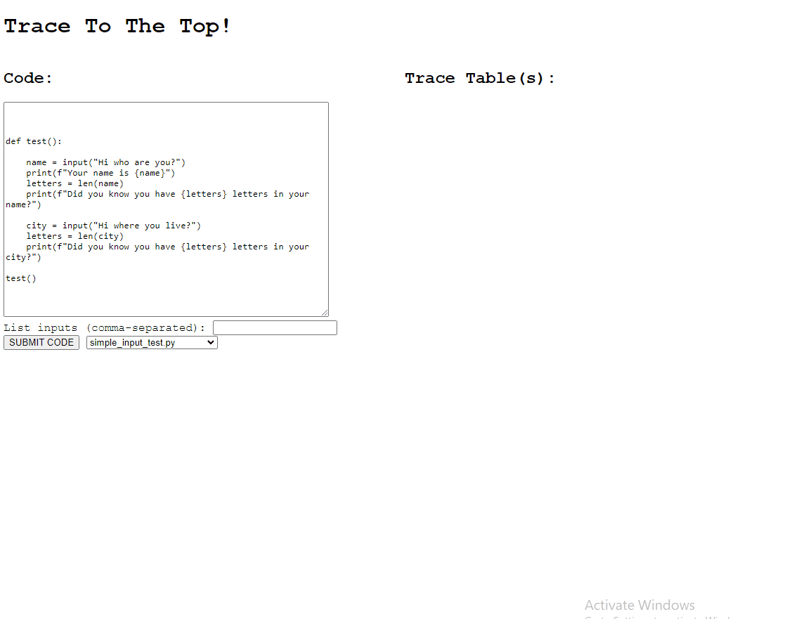

# trace_to_the_top
Program code → trace table → exp evaluation queue → HTML/CSS animated frontend

## Progress so far:

## Notes:

- parsing statement execution order and memory changes separately does not make sense
- need to fix out of sync issues occurred when function with no params encountered
- how to acknowledge value has been re-evaluated/re-assigned vs. stayed the same due to no expression affecting it?
